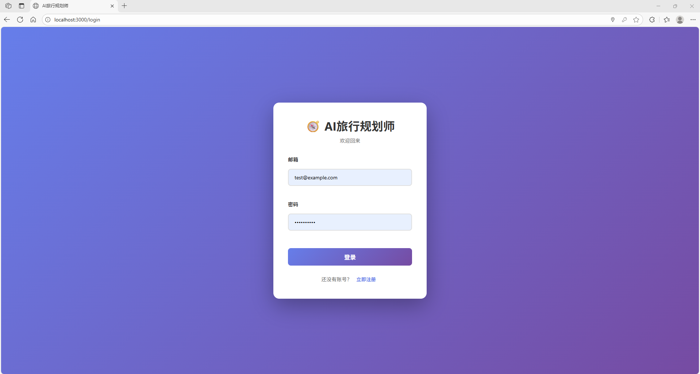
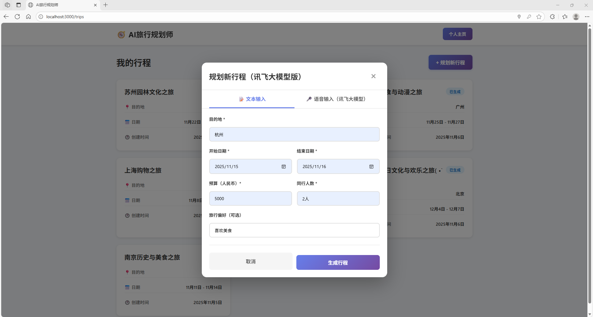
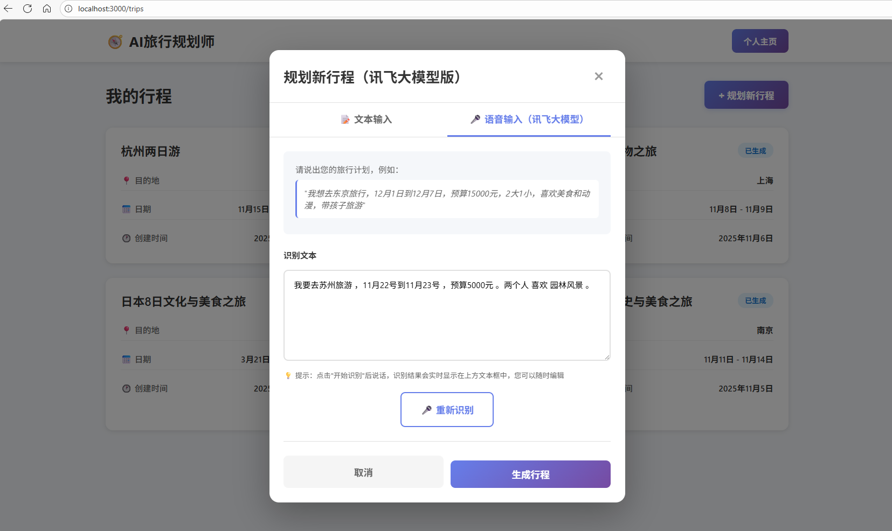
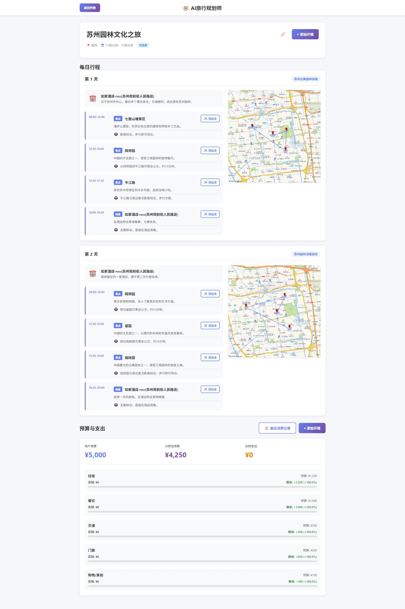
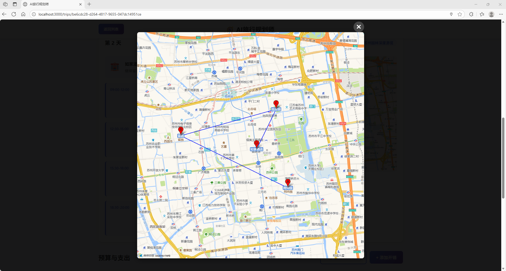
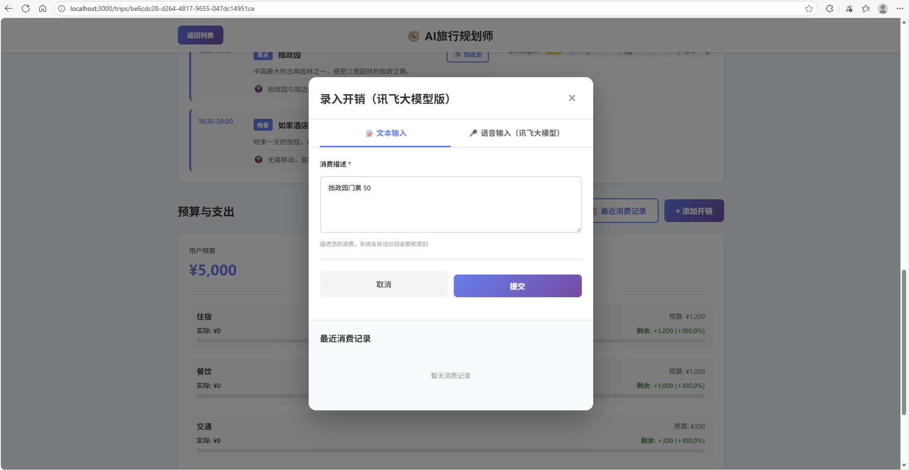
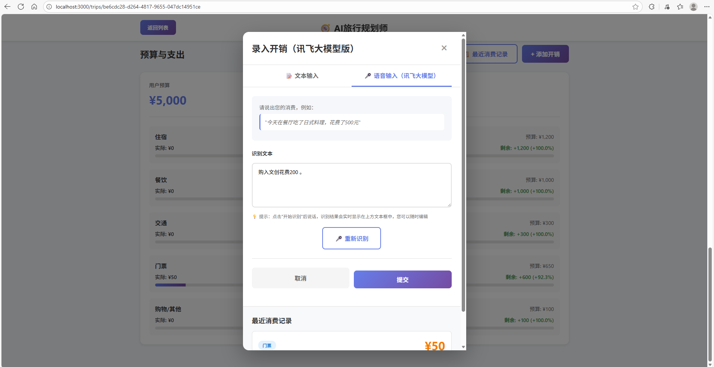
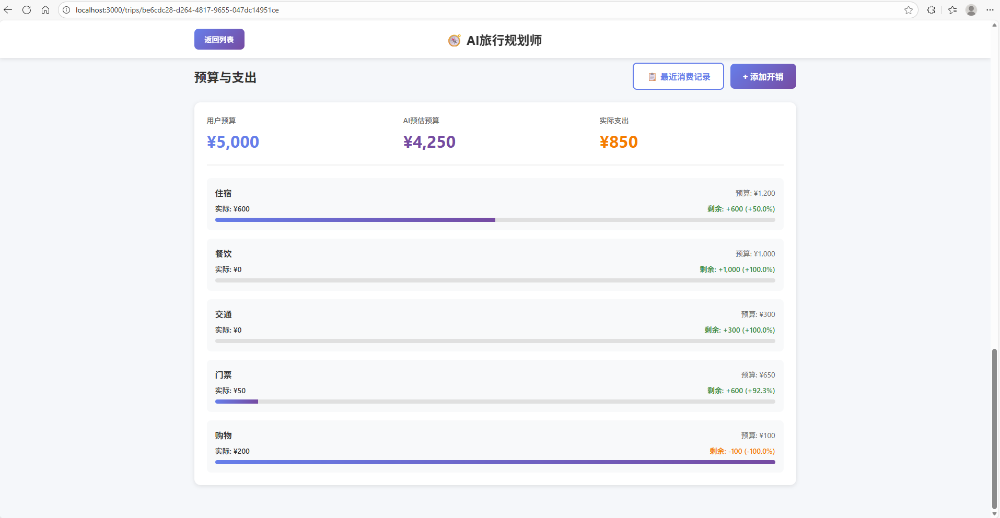
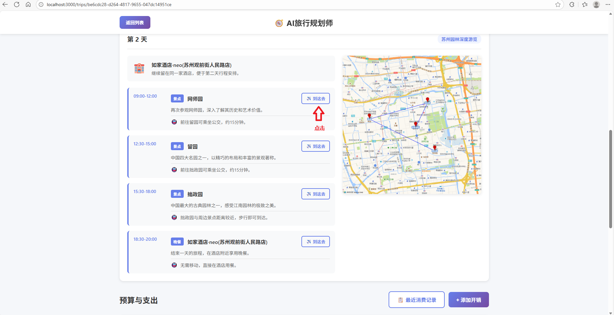
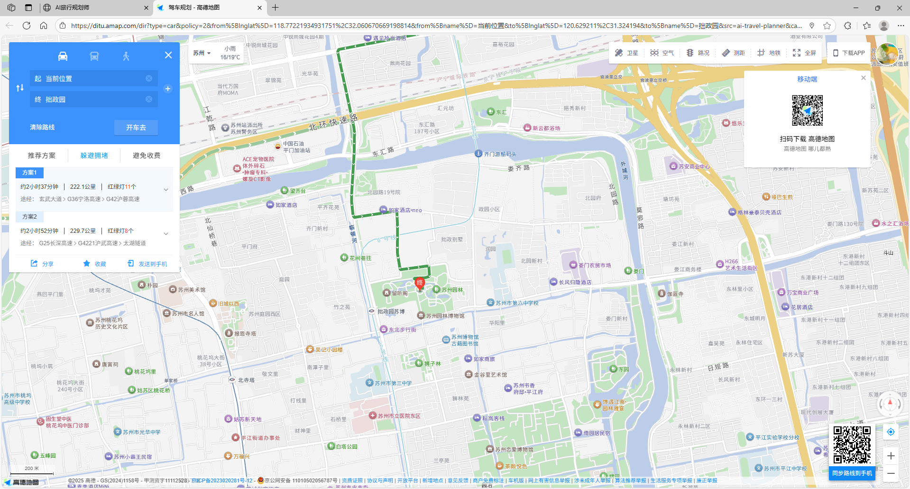

# 🗺️ AI Travel Planner

> 基于 AI 大语言模型的智能旅行规划平台，支持语音输入、智能行程生成和费用管理

[](https://fastapi.tiangolo.com/)
[](https://reactjs.org/)
[](https://www.typescriptlang.org/)
[](https://www.docker.com/)

## ✨ 核心亮点

- 🤖 **AI 驱动**：集成通义千问 LLM，智能生成个性化旅行计划
- 🎤 **语音交互**：支持科大讯飞实时语音转文字，语音创建行程和记录费用
- 🗺️ **地图集成**：自动检索 POI、规划路线、预估交通耗时
- 💰 **智能预算**：AI 自动估算预算，实时记录开销，预算对比分析
- 🐳 **容器化部署**：完整的 Docker 支持，一键启动
- 🔒 **安全设计**：环境变量隔离，API Key 不打包进镜像

## 🚀 功能特性

### 用户系统
- ✅ 用户注册/登录（JWT 认证）
- ✅ 用户资料管理
- ✅ 旅行偏好设置

### 智能行程规划
- ✅ **文本输入**：通过填入目的地、日期、人数、预算、偏好（可选）生成行程
- ✅ **语音输入**：实时语音转文字，自动解析旅行意图
- ✅ **POI 检索**：自动搜索景点、餐厅、酒店
- ✅ **智能决策**：LLM 优化每日行程安排和交通方式
- ✅ **路线规划**：自动计算景点间交通方式
- ✅ **地图可视化**：展示行程路线和地点标记

### 费用管理
- ✅ **预算估算**：AI 根据行程自动估算总预算和分类预算
- ✅ **开销记录**：支持文本和语音两种方式记录实际开销
- ✅ **智能分类**：LLM 自动识别和分类消费项目
- ✅ **预算对比**：实时对比预算与实际支出

## 📁 项目结构

```
AI_Travel_Planner/
├── travel_backend/          # 后端服务 (FastAPI)
│   ├── app/
│   │   ├── api/            # API 路由层
│   │   │   ├── auth.py     # 认证相关
│   │   │   ├── plan.py     # 行程规划
│   │   │   ├── budget.py   # 费用管理
│   │   │   └── voice_realtime.py  # 实时语音
│   │   ├── services/       # 业务逻辑层
│   │   │   ├── ai_service.py      # LLM 服务
│   │   │   ├── voice_service.py   # 语音处理
│   │   │   ├── map_service.py     # 地图服务
│   │   │   ├── trip_service.py    # 行程服务
│   │   │   └── expense_service.py # 费用服务
│   │   ├── data/           # 数据访问层
│   │   └── models/         # 数据模型
│   ├── config/             # 配置管理
│   └── main.py             # 应用入口
│
├── travel_frontend/        # 前端应用 (React + TypeScript)
│   ├── src/
│   │   ├── pages/          # 页面组件
│   │   │   ├── LoginPage.tsx
│   │   │   ├── TripListPage.tsx
│   │   │   ├── TripDetailPage.tsx
│   │   │   └── ProfilePage.tsx
│   │   ├── components/     # 功能组件
│   │   │   ├── CreateTripModal.tsx      # 创建行程
│   │   │   ├── CreateTripModalXunfeiLLM.tsx  # 语音创建
│   │   │   ├── ExpenseModal.tsx         # 费用录入
│   │   │   └── ExpenseModalXunfeiLLM.tsx     # 语音录入
│   │   ├── api/            # API 调用
│   │   └── routes/         # 路由配置
│   └── nginx.conf          # Nginx 配置
│
├── docker-compose.yml      # Docker Compose 配置
├── build-docker.sh        # 镜像构建脚本 (Linux/macOS)
└── build-docker.ps1       # 镜像构建脚本 (Windows)
```

## 🛠️ 技术栈

### 后端
- **框架**: FastAPI
- **LLM**: 通义千问 (通过 LangChain)
- **语音**: 科大讯飞 API
- **地图**: 高德地图 API
- **数据库**: Supabase (PostgreSQL)
- **认证**: JWT
- **容器**: Docker

### 前端
- **框架**: React 18 + TypeScript
- **构建工具**: Vite
- **路由**: React Router
- **HTTP 客户端**: Axios
- **部署**: Nginx (Docker)

## 🚀 快速开始
### **前置要求**

- Supabase 项目（用于数据库）
- API 密钥：
  - 通义千问 API Key
  - 科大讯飞 API（用于语音功能）
  - 高德地图 API（用于地图功能）

### 开发环境运行

**1. 克隆项目**

```bash
git clone https://github.com/jiadebushi/AI-TRAVEL-PLANNER.git
cd AI_Travel_Planner
```

**2. 后端运行**

- Python 3.10+
- ffmpeg（用于音频处理）

```bash
# 进入后端目录
cd travel_backend

# 安装依赖
pip install -r requirements.txt

# 配置环境变量
cp .env.example .env
# 编辑 .env 文件，填入你的 API 密钥

# 运行后端服务
uvicorn main:app --reload --host 0.0.0.0 --port 8000
```

后端服务将在 http://localhost:8000 启动

**3. 前端运行**

- Node.js 18+

```bash
# 进入前端目录
cd travel_frontend

# 安装依赖
npm install

# 启动开发服务器
npm run dev
```

前端应用将在 http://localhost:3000 启动

> **注意**：前端已配置代理，`/api` 请求会自动转发到后端 `http://localhost:8000`

### Docker运行

具体见文档：[运行与部署](./README-运行与部署.md) 

**前置要求**

- Docker & Docker Compose

**1. 克隆项目**

```bash
git clone https://github.com/jiadebushi/AI-TRAVEL-PLANNER.git
cd AI_Travel_Planner
```

**2. 配置环境变量**

```bash
# 复制环境变量示例文件
cp travel_backend/.env.example travel_backend/.env

# 编辑 travel_backend/.env，填入你的 API 密钥
# 必需配置：
# - QIANWEN_API_KEY (通义千问)
# - SECRET_KEY (JWT 密钥)
# - SUPABASE_URL, SUPABASE_KEY, SUPABASE_SERVICE_KEY
```

**3. 启动服务**

```bash
# 使用 Docker Compose 启动
docker-compose up -d

# 查看服务状态
docker-compose ps

# 查看日志
docker-compose logs -f
```

**4. 访问应用**

- 🌐 **前端**: http://localhost:3000
- 🔌 **后端 API**: http://localhost:8000
- 📚 **API 文档**: http://localhost:8000/docs

## 📦 Docker 镜像部署
详细的Docker部署说明请参考：[Docker 部署指南](./Docker部署指南.md)

## 🔒 安全说明

- ✅ `.env` 文件**不会**被打包进 Docker 镜像
- ✅ 每个用户需要配置自己的 API Key
- ✅ 镜像中不包含任何敏感信息
- ✅ 运行时通过 `env_file` 从宿主机读取配置

## 📚 文档

- [Docker 部署指南](./Docker部署指南.md) - 详细的 Docker 部署说明
- [运行与部署](./README-运行与部署.md) - 完整的运行指南
- [后端 API 文档](./travel_backend/docs/API接口文档.md) - API 接口说明

## ⚠️ 注意事项：语音识别 WebSocket

- Docker 容器中运行时，语音识别可能报 **WebSocket 连接失败 (1006)**。
- 原因：后端生成讯飞 WebSocket URL 的时间戳与时区不一致  
  - 容器默认时间为 **UTC**  
  - 后端设置 URL 中固定使用 **+0800** 时区
- 解决方案：修改后端生成时间为 **北京时间 (UTC+8)**  
  - 保证数字时间与 `+0800` 一致
  - WebSocket 可以正常连接
  ```python
  now = datetime.now(timezone(timedelta(hours=8)))
  ```


## 🤝 贡献

欢迎提交 Issue 和 Pull Request！

## 📄 许可证

[MIT License](LICENSE)

---

## 📸 功能展示

### 用户登录


### 行程规划

#### 文本输入创建行程


#### 语音输入创建行程


#### 行程列表


#### 行程详情


#### 每日规划地图


### 费用管理

#### 文本输入开销


#### 语音输入开销


#### 开销录入后展示


### 地图导航

#### 便捷导航功能


#### 高德地图集成


---

**⭐ 如果这个项目对你有帮助，请给个 Star！**

